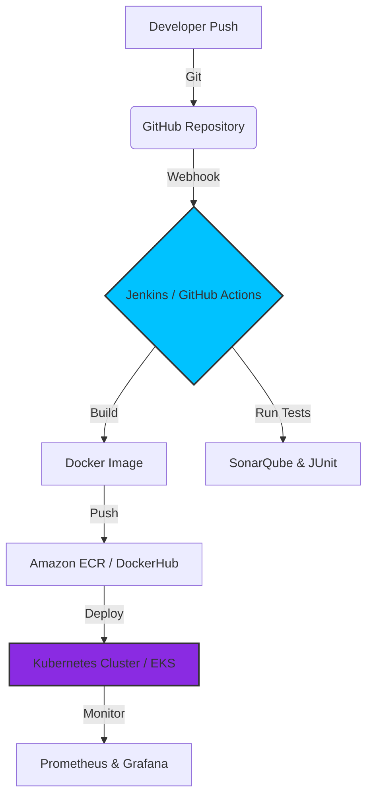

 

  

---

## 💫 About Me

I am a Software Engineering undergraduate and DevOps enthusiast based in Kalutara, Sri Lanka. With a strong foundation in cloud-native architectures, distributed systems, and CI/CD pipelines, I am passionate about building scalable infrastructure and automating deployments. I am deeply focused on integrating machine learning models into production environments through efficient **MLOps** practices.

- 🎓 **Undergraduate:** BSc (Hons) Software Engineering at the University of Kelaniya
- 💻 **Professional Studies:** CMJD Professional at IJSE - Institute of Software Engineering
- 🐧 **Daily Driver:** Native Fedora Linux user
- 🌱 **Currently Exploring:** Advanced Kubernetes, Terraform, AWS Solutions Architecture, and MLOps infrastructure.

---

## 🛠 Tech Stack & Tools

  <!-- Dedicated Fedora Daily Driver Badge -->
  
    
  
  <!-- Main Tech Stack Grid -->
  

 

| Domain | Technologies |
|---|---|
| **Cloud & IaC** | AWS (EC2, S3, VPC), Terraform, Docker, Kubernetes |
| **Automation & CI/CD** | Jenkins, GitHub Actions, Argo CD, Ansible |
| **Development** | Java (OOP, SOLID, Design Patterns), Python, React 19, Spring Boot |
| **MLOps & Monitoring** | Model Deployment, Prometheus, Grafana |

 

<b>🛠️ View My Advanced Toolset (Click to Expand)</b>

 

- **OS:** Fedora Linux (Terminal Power User)
- **Container Orchestration:** Argo CD, Kubernetes
- **Design Patterns:** SOLID Principles, Factory Pattern, Dependency Inversion
- **Cloud Infrastructure:** AWS (EC2, S3, VPC Management)

---

## 🌍 Open Source Contributions

Passionate about cloud-native infrastructure, identity management, and model serving platforms, I actively engage with enterprise-grade open-source ecosystems.

- 🚀 **[WSO2](https://github.com/wso2):** Actively contributing to the enterprise ecosystem with multiple impactful merged contributions:
  - Contributed a merged Pull Request to the WSO2 Identity Server platform documentation: **[wso2/docs-is#6202](https://github.com/wso2/docs-is/pull/6202)**.
  - Ported advanced AWS SQS custom endpoint and S3 path-style addressing (`forcePathStyle`) configuration references to main: **[wso2/docs-mi#2336](https://github.com/wso2/docs-mi/pull/2336)**.
- 🤖 **[KServe](https://github.com/kserve):** Exploring and engaging with highly scalable machine learning model serving infrastructure.
- 🚢 **[OpenChoreo](https://github.com/openchoreo):** Contributing to `openchoreo/openchoreo` and related deployment tools.
- 📦 **Community Activity:** Actively collaborating across 30+ repositories with an activity footprint of **75% Commits** and **25% Pull Requests**.

  
  

---

## ⚙️ Core CI/CD & MLOps Architecture Workflow

---

## 📝 Latest Technical Writings

<!-- BLOG-POST-LIST:START -->
- [Why Linux is the Bedrock of DevOps: Core Kernel &amp; Shell Principles Every Engineer Must Master](https://medium.com/@chanindu.imanjith/why-linux-is-the-bedrock-of-devops-core-kernel-shell-principles-every-engineer-must-master-eac15daa02cd?source=rss-c34493618601------2)
- [Stop Shipping Bloatware: A Deep Dive into Multi-Stage Docker Builds for Production Apps](https://medium.com/@chanindu.imanjith/stop-shipping-bloatware-a-deep-dive-into-multi-stage-docker-builds-for-production-apps-4e137d59459c?source=rss-c34493618601------2)
- [Beyond the Wall of Text: Why Diagrams Are the Secret to Technical Clarity](https://medium.com/@chanindu.imanjith/beyond-the-wall-of-text-why-diagrams-are-the-secret-to-technical-clarity-0a9c5febfbe2?source=rss-c34493618601------2)
- [Modeling the Digital Pandemic: How Better Math Can Stop Malware in Its Tracks](https://medium.com/@chanindu.imanjith/modeling-the-digital-pandemic-how-better-math-can-stop-malware-in-its-tracks-485f8b0e52cd?source=rss-c34493618601------2)
- [CIA Triad in Cyber Security](https://medium.com/@chanindu.imanjith/cia-triad-in-cyber-security-3a010af941d1?source=rss-c34493618601------2)
<!-- BLOG-POST-LIST:END -->

---

## 📊 GitHub Analytics

 

  

---

## 🐍 Contribution Graph

  

---

