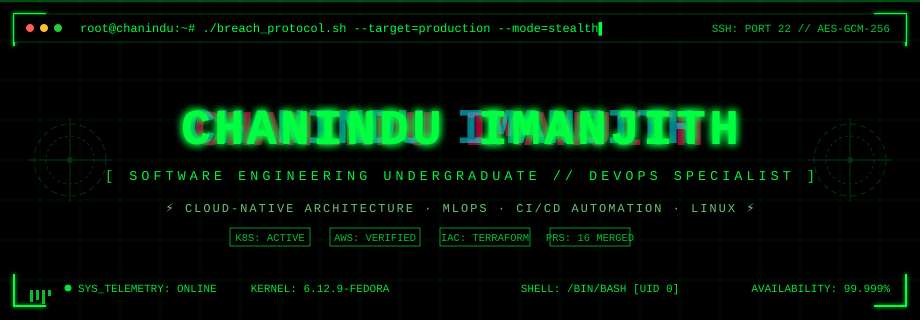
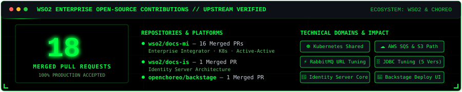

<div align="center">



<p align="center">
  <a href="https://github.com/ChaninduImanjith">
    
  </a>
</p>


<br>

[](#)
<a href="mailto:chanindu.imanjith@gmail.com">

</a>
<a href="https://www.linkedin.com/in/chanindu-imanjith-72814431b">

</a>
<a href="https://github.com/ChaninduImanjith">

</a>
<a href="https://chanindu-portfolio-v2.netlify.app/">

</a>


</div>

<p align="center">
  
</p>

### <code>root@chanindu:~# cat /etc/motd</code>

```bash
┌──[ SYSTEM TELEMETRY & BIOMETRICS ]────────────────────────────────────────────┐
│ USER       : Chanindu Imanjith                                                │
│ HOST       : fedora-workstation (x86_64)                                      │
│ UPTIME     : 100% (High Availability)                                         │
│ ROLE       : Software Engineering Undergraduate & AI Platform Enthusiast      │
│ LOCATION   : Colombo, Sri Lanka                                               │
│ STATUS     : Ready for Deployment // Access: ROOT                             │
└───────────────────────────────────────────────────────────────────────────────┘
```

### <code>chanindu@fedora:~$ cat /home/chanindu/.profile_bio</code>

```bash
Software Engineering undergraduate and DevOps enthusiast based in Colombo,
Sri Lanka, with a strong foundation in cloud-native architectures, distributed
systems, and CI/CD pipelines. Focused on building scalable infrastructure and
automating deployments, with a deep interest in integrating machine learning
models into production environments through efficient MLOps practices.
```

### <code>chanindu@fedora:~$ neofetch --system-specs</code>

| `SYSTEM_KEY` | `HARDWARE / ACADEMIC REGISTRY` |
|:---|:---|
| `🎓 Undergraduate` | `BSc (Hons) Software Engineering — University of Kelaniya` |
| `💼 Professional Studies` | `CMJD Professional — IJSE (Institute of Software Engineering)` |
| `🐧 Daily Driver` | `Fedora Linux (terminal power user)` |
| `🌱 Currently Exploring` | `Advanced Kubernetes, Terraform, AWS Solutions Architecture, MLOps infrastructure` |

<p align="center">
  
</p>

### <code>chanindu@fedora:~$ ./inspect_toolset.sh --active-modules</code>

<div align="center">
  
</div>

<br>

| `SUBSYSTEM` | `DEPLOYED PACKAGES & FRAMEWORKS` |
|:---|:---|
| `☁️ Cloud & IaC` | `AWS (EC2, S3, VPC)` · `Terraform` · `Docker` · `Kubernetes` |
| `⚡ Automation & CI/CD` | `Jenkins` · `GitHub Actions` · `Argo CD` · `Ansible` |
| `💻 Development` | `Java (OOP, SOLID, Design Patterns)` · `Python` · `React 19` · `Spring Boot` |
| `📊 MLOps & Monitoring` | `Model Deployment` · `Prometheus` · `Grafana` |

<details>
<summary><code><b>[+] cat /etc/sysconfig/additional-toolset.conf (Click to expand)</b></code></summary>

```bash
# ==============================================================================
# ADDITIONAL SYSTEM TOOLSET & DESIGN ARCHITECTURES
# ==============================================================================
[OS]                     : Fedora Linux (terminal power user)
[CONTAINER_ORCHESTRATION]: Argo CD, Kubernetes
[DESIGN_PATTERNS]        : SOLID Principles, Factory Pattern, Dependency Inversion
[CLOUD_INFRASTRUCTURE]   : AWS (EC2, S3, VPC Management)
```

</details>

<p align="center">
  
</p>

### <code>root@fedora:~# journalctl -u oss-contributions.service --no-pager</code>

<div align="center">
  
</div>

<br>

```bash
[TARGET_ECOSYSTEMS] : Enterprise-grade cloud-native platforms | Identity management | Model serving
[COMMUNITY_METRICS] : Collaborating across 30+ repositories · 75% Commits · 25% Pull Requests
```

- <code>[UPSTREAM]</code> **[WSO2](https://github.com/wso2)** — `16 merged pull requests to wso2/docs-mi, 1 to wso2/docs-is`
  - <code>├── [PR #2473]</code> `Ported MCP server documentation to the WSO2 Integrator: MI 4.6.0 documentation` ➔ **[wso2/docs-mi#2473](https://github.com/wso2/docs-mi/pull/2473)**
  - <code>├── [PR #2443]</code> `Fixed a broken sample WSDL download link in the proxy service introduction documentation` ➔ **[wso2/docs-mi#2443](https://github.com/wso2/docs-mi/pull/2443)**
  - <code>├── [PR #2444]</code> `Added Kubernetes deployment guidance for shared registry mounting across active-active WSO2 Integrator: MI clusters` ➔ **[wso2/docs-mi#2444](https://github.com/wso2/docs-mi/pull/2444)**
  - <code>├── [PR #2349]</code> `Ported RabbitMQ URL placeholder and blocking-mode message builder/formatter documentation across 3 product versions` ➔ **[4.4.0](https://github.com/wso2/docs-mi/pull/2349)** · **[4.3.0](https://github.com/wso2/docs-mi/pull/2350)** · **[4.2.0](https://github.com/wso2/docs-mi/pull/2351)**
  - <code>├── [PR #2439]</code> `Ported network-related JDBC Message Store tuning tips across 5 product versions` ➔ **[main](https://github.com/wso2/docs-mi/pull/2439)** · **[4.6.0](https://github.com/wso2/docs-mi/pull/2437)** · **[4.4.0](https://github.com/wso2/docs-mi/pull/2440)** · **[4.3.0](https://github.com/wso2/docs-mi/pull/2441)** · **[4.2.0](https://github.com/wso2/docs-mi/pull/2442)**
  - <code>├── [PR #2387]</code> `Fixed a broken WSO2 Integration Studio download link across 4 product versions` ➔ **[4.4.0](https://github.com/wso2/docs-mi/pull/2387)** · **[4.3.0](https://github.com/wso2/docs-mi/pull/2388)** · **[4.2.0](https://github.com/wso2/docs-mi/pull/2389)**
  - <code>├── [PR #2336]</code> `Ported advanced AWS SQS custom endpoint and S3 path-style addressing (forcePathStyle) configuration references to main` ➔ **[wso2/docs-mi#2336](https://github.com/wso2/docs-mi/pull/2336)**
  - <code>├── [PR #2335]</code> `Updated AWS SQS connector custom endpoint documentation for the 4.5.0 release` ➔ **[wso2/docs-mi#2335](https://github.com/wso2/docs-mi/pull/2335)**
  - <code>└── [PR #6202]</code> `Contributed a merged pull request to the WSO2 Identity Server platform documentation` ➔ **[wso2/docs-is#6202](https://github.com/wso2/docs-is/pull/6202)**

- <code>[UPSTREAM]</code> **[OpenChoreo](https://github.com/openchoreo)** — `contributing to openchoreo/backstage-plugins and related deployment tools`
  - <code>└── [PR #749]</code> `Merged bug fix resolving an incorrect "Failed" status shown in the Deploy UI during normal namespace provisioning` ➔ **[openchoreo/backstage-plugins#749](https://github.com/openchoreo/backstage-plugins/pull/749)**

- <code>[EXPLORING]</code> **[KServe](https://github.com/kserve)** — `exploring and engaging with highly scalable machine learning model-serving infrastructure`

<br>

<div align="center">


</div>

<p align="center">
  
</p>

### <code>chanindu@fedora:~$ curl -s https://medium.com/feed/@chanindu.imanjith | parse-feed</code>

<!-- BLOG-POST-LIST:START -->
- [Why Linux is the Bedrock of DevOps: Core Kernel &amp; Shell Principles Every Engineer Must Master](https://medium.com/@chanindu.imanjith/why-linux-is-the-bedrock-of-devops-core-kernel-shell-principles-every-engineer-must-master-eac15daa02cd?source=rss-c34493618601------2)
- [Stop Shipping Bloatware: A Deep Dive into Multi-Stage Docker Builds for Production Apps](https://medium.com/@chanindu.imanjith/stop-shipping-bloatware-a-deep-dive-into-multi-stage-docker-builds-for-production-apps-4e137d59459c?source=rss-c34493618601------2)
- [Beyond the Wall of Text: Why Diagrams Are the Secret to Technical Clarity](https://medium.com/@chanindu.imanjith/beyond-the-wall-of-text-why-diagrams-are-the-secret-to-technical-clarity-0a9c5febfbe2?source=rss-c34493618601------2)
- [Modeling the Digital Pandemic: How Better Math Can Stop Malware in Its Tracks](https://medium.com/@chanindu.imanjith/modeling-the-digital-pandemic-how-better-math-can-stop-malware-in-its-tracks-485f8b0e52cd?source=rss-c34493618601------2)
- [CIA Triad in Cyber Security](https://medium.com/@chanindu.imanjith/cia-triad-in-cyber-security-3a010af941d1?source=rss-c34493618601------2)
<!-- BLOG-POST-LIST:END -->

<p align="center">
  
</p>

### <code>chanindu@fedora:~$ gh telemetry --render-matrix</code>

<div align="center">
  
  
</div>

<br>

<div align="center">
  
</div>

<br>

<div align="center">

### <code>[ CONTRIBUTION_MATRIX // SNAKE_PROTOCOL ]</code>


</div>
